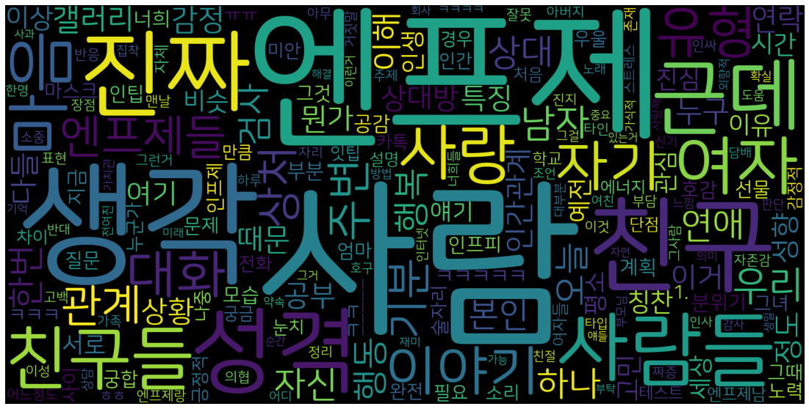

# MBTI Wordcloud

Create wordcloud using posts from MBTI (Myers–Briggs Type Indicator) galleries in DC Inside.

Example: Wordcloud ENFJ gallery

## Dependency

- Python 3
- pandas
- numpy
- konlpy
- wordcloud
- matplotlib

## Reference

- https://shlee1990.tistory.com/864
